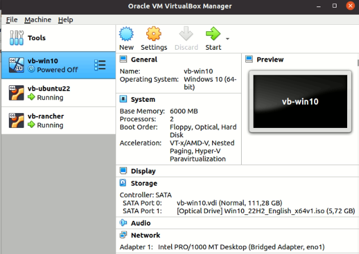

# Prerequisite

```
VirtualBox Name : vb-win10
IP : 192.168.0.213
User : userpc
Password : userpc123456
RAM : 6 GB
CPU : 2 
enable nested vt-x/amd-v
```

```
VirtualBox Name : vb-ubuntu22
IP : 192.168.0.210
User : ubuntu
Password : ubuntu
RAM : 6 GB
CPU : 2
enable nested vt-x/amd-v
```

```
VirtualBox Name : vb-rancher
IP : 192.168.0.209
User : ubuntu
Password : ubuntu
RAM : 6 GB
CPU : 2
enable nested vt-x/amd-v
```




